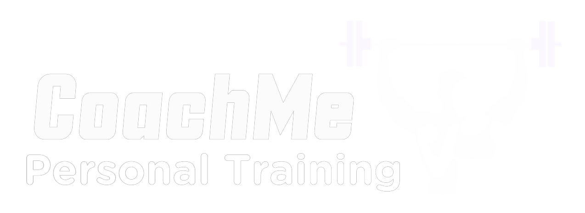
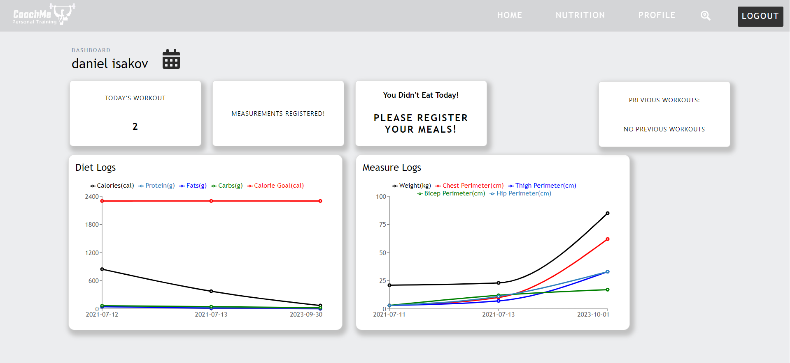
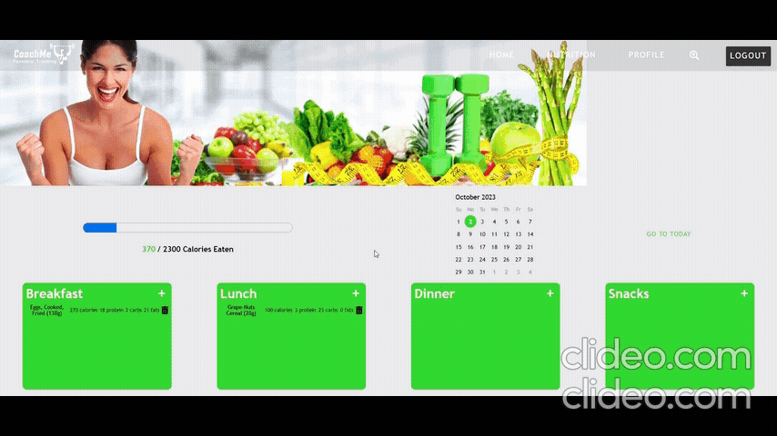
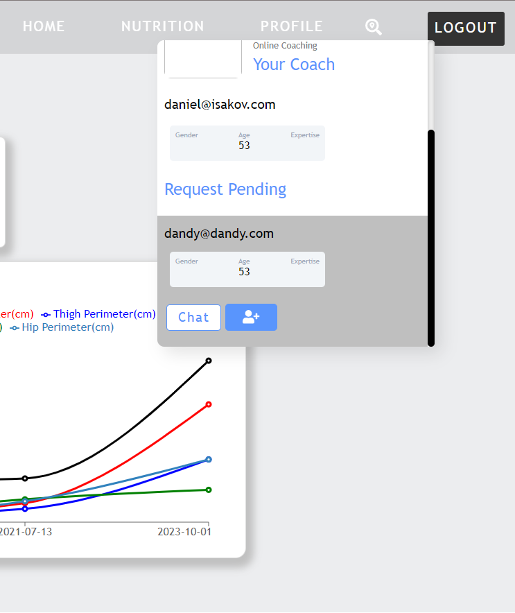
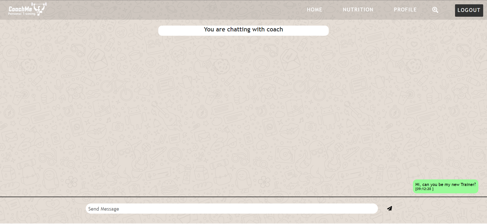

# Coach-Me-Danny

## Cyber4s final project. CoachMe takes personal training to the next level.

## About the Project

For our final project in the Cyber4s course, we chose to unite our two passions: sports and our newfound interest, coding. Once we determined that our project would focus on fitness, we discussed our training routines and the apps/websites we use. During conversations with fitness trainers, we learned that they manage all their activities through WhatsApp and Excel files.
We used the new technologies we learned to design a website that greatly facilitates communication between trainees and coaches.

## Technologies We Used

- <u>**Client side Framework**</u>- React
- <u>**Server side Environment**</u>- Node.js
- <u>**Manage Server Routes**</u>- Express.js
- <u>**Authentication**</u>- Firebase
- <u>**Live Chat**</u>- Socket.io
- <u>**Database**</u>- MySQL
- <u>**ORM**</u>- Sequelize
- <u>**HTTP Requests**</u>- Axios
- <u>**Debounce**</u>- Lodash
- <u>**Client Side Navigation**</u>- React router dom
- <u>**Charts Display**</u>- Rechart

## Features

**_Authentication-_** Using Firebase were able to protect our clients the best way possible. In addition the users are able to log in with their Google and Facebook accounts.  
**_Charts that display an improvement curve-_** With Rechart we can display the trainee improvement on charts (Diet logs and Measure logs).  
**_Food Data-Set-_** Large data set of food with his nutritional information.  
**_Workout Calendar-_** With a built in calendar your coach can can plan yor monthly workout routine. The coach can build any workout he wants using a large workout exercises data set.  
**_Design-_** Unique design using Sass and animations.  
**_Real time notifications-_** With Socket.io you get notified at real time when you get friends request or messages.

## Photos

- ### Home page + sign up using Firebase
  
- ### Dashboard with all essential data displayed in graphs
  
- ### Meal/Calorie tracker
  
- ### Search and add a coach to friends list
  
  - ### Live Chat
    
